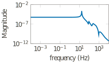

---
jupytext:
  text_representation:
    extension: .md
    format_name: myst
    format_version: 0.13
    jupytext_version: 1.15.0
kernelspec:
  display_name: Python 3 (ipykernel)
  language: python
  name: python3
---

+++ {"editable": true, "slideshow": {"slide_type": "slide"}}

# Second-order Systems

$$
\newcommand{\bbC}{\mathbb{C}}
\newcommand{\Cnn}{\bbC^{n \times n}}
\newcommand{\Cpm}{\bbC^{p \times m}}
\newcommand{\bbR}{\mathbb{R}}
\newcommand{\Rn}{\bbR^{n}}
\newcommand{\Rr}{\bbR^{r}}
\newcommand{\Rm}{\bbR^{m}}
\newcommand{\Rp}{\bbR^{p}}
\newcommand{\Rk}{\bbR^{k}}
\newcommand{\Rnn}{\bbR^{n \times n}}
\newcommand{\Rnm}{\bbR^{n \times m}}
\newcommand{\Rpn}{\bbR^{p \times n}}
\newcommand{\Rpm}{\bbR^{p \times m}}
\newcommand{\Rnr}{\bbR^{n \times r}}
\newcommand{\Rrr}{\bbR^{r \times r}}
\newcommand{\Rrm}{\bbR^{r \times m}}
\newcommand{\Rpr}{\bbR^{p \times r}}
\newcommand{\cH}{\mathcal{H}}
\newcommand{\cK}{\mathcal{K}}
\newcommand{\cL}{\mathcal{L}}
\newcommand{\cT}{\mathcal{T}}
\newcommand{\hA}{\hat{A}}
\newcommand{\hB}{\hat{B}}
\newcommand{\hC}{\hat{C}}
\newcommand{\hE}{\hat{E}}
\newcommand{\hH}{\hat{H}}
\newcommand{\hY}{\hat{Y}}
\newcommand{\hx}{\hat{x}}
\newcommand{\hy}{\hat{y}}
\newcommand{\tA}{\tilde{A}}
\newcommand{\tB}{\tilde{B}}
\newcommand{\tC}{\tilde{C}}
\newcommand{\tE}{\tilde{E}}
\newcommand{\tran}{\operatorname{T}}
\newcommand{\herm}{\operatorname{H}}
\newcommand{\Real}{\operatorname{Re}}
\newcommand{\imag}{\boldsymbol{\imath}}
\newcommand{\tr}{\operatorname{tr}}
\newcommand{\myspan}{\operatorname{span}}
\newcommand{\dif}[1]{\operatorname{d}\!{#1}}
$$

+++ {"editable": true, "slideshow": {"slide_type": "subslide"}}

### Second-order State-space Systems (pyMOR: `SecondOrderModel`)

$$
\begin{align*}
  M \ddot{x}(t) + E \dot{x}(t) + K x(t)  &= B u(t), \\
  y(t) & = C_{\text{p}} x(t) + C_{\text{v}} \dot{x}(t).
\end{align*}
$$

Here

- $x(t) \in \Rn$ is called the *position*,
- $\dot{x}(t) \in \Rn$ is called the *velocity*,
- $u(t) \in \Rm$ is called the *input*,
- $y(t) \in \Rp$ is called the *output*

of the second-order LTI system.
Correspondingly, we have

$$
\begin{align*}
  M, E, K \in \Rnn, \qquad
  B \in \Rnm, \qquad
  C_{\text{p}}, C_{\text{v}} \in \Rpn.
\end{align*}
$$

+++ {"editable": true, "slideshow": {"slide_type": "subslide"}}

## Examples

+++ {"editable": true, "slideshow": {"slide_type": "subslide"}}

### An Artificial Fishtail ([MORWiki Artificial Fishtail](https://morwiki.mpi-magdeburg.mpg.de/morwiki/index.php/Artificial_Fishtail))

<table>
<tr>
<td>

**Construction:**

</td>
<td>

**Fluid Elastomer Actuation:**

**no pressure**

**under pressure**

</td>
</tr>
</table>

+++ {"editable": true, "slideshow": {"slide_type": "subslide"}}

**Variables:**
displacement $\vec{s}(t, \vec{z})$,
strain $\underline{\vec{\varepsilon}}(\vec{s}(t, \vec{z}))$,
stress $\underline{\vec{\sigma}}(\vec{s}(t, \vec{z}))$.

**Material parameters:**
density $\rho$,
Lamé parameters $\lambda$, $\mu$.

**Basic principle:**

$$
\begin{align*}
  \underline{\vec{\varepsilon}}(\vec{s}(t, \vec{z}))
  & =
    \frac{1}{2}
    \left(
      \nabla \vec{s}(t, \vec{z})
      + \nabla^{\tran} \vec{s}(t, \vec{z})
    \right)
  & \text{(kinematic equation)} \\
  \underline{\vec{\sigma}}(\vec{s}(t, \vec{z}))
  & =
    \lambda
    \tr\!\left(
      \left(
        \underline{\vec{\varepsilon}}(\vec{s}(t, \vec{z}))
      \right)
      \underline{I}
      + 2 \mu \underline{\vec{\varepsilon}}(\vec{s}(t, \vec{z}))
    \right)
  & \text{(material equation)} \\
  \rho \frac{\partial^{2} \vec{s}(t, \vec{z})}{\partial t^{2}}
  & =
    \nabla \cdot \underline{\vec{\sigma}}(\vec{s}(t, \vec{z}))
    + \vec{f}(t, \vec{z})
  & \text{(equation of motion)}
\end{align*}
$$

**+** initial and boundary conditions

+++ {"editable": true, "slideshow": {"slide_type": "subslide"}}

FEM semi-discretization:

$$
\begin{align*}
  M \ddot{x}(t) + E \dot{x}(t) + K x(t) & = B u(t), \\
  y(t) & = C_{\text{p}} x(t),
\end{align*}
$$

with

- $M, E, K > 0$, $C_{\text{v}} = 0$,
- $n = 779\,232$, $m = 1$, $p = 3$.

+++ {"editable": true, "slideshow": {"slide_type": "subslide"}}

## Transfer Function

Analogous to first-order systems, for second-order systems we get

$$
H(s) =
\left(s C_{\text{v}} + C_{\text{p}} \right)
{\left(s^2 M + s E + K\right)}^{-1}
B.
$$

+++ {"editable": true, "slideshow": {"slide_type": "fragment"}}

$$
H \text{ is analytic in } \bbC \setminus \Lambda(M, E, K).
$$

+++ {"editable": true, "slideshow": {"slide_type": "subslide"}}

### Sigma Magnitude Plot for the Artificial Fishtail

